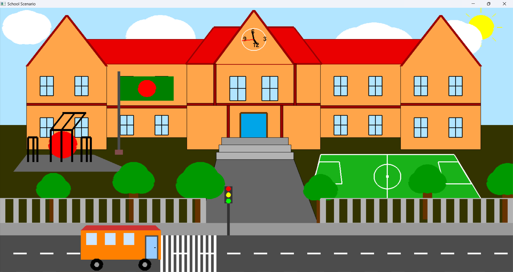

# School Scenario Project

## Description

The **School Scenario Project** is a computer graphics simulation built using **OpenGL**, designed to create a dynamic 2D representation of a school environment. The project features a movable bus, road, field, school building, and various landmarks such as the **Shohid Minar**. These elements are created using basic 2D shapes, textures, and transformations to simulate real-world objects and movements. The main objective of this project is to demonstrate the principles of computer graphics including transformation, lighting, texture mapping, and interactive animation.

### Key Features:
- **Moveable Bus:** A 2D model of a bus that moves along the road path, controlled by user input (arrow keys or mouse).
- **Road & Field:** Dynamic creation of roads and fields with realistic textures and lighting effects.
- **School Building:** A 2D model of a school with multiple levels and details, including windows, doors, and walls.
- **Shohid Minar:** A representation of the Shohid Minar monument, recreated in 2D with appropriate textures and details.
- **Interactive Animation:** User controls to interact with the scene, such as moving the bus, rotating the camera, or adjusting the lighting.
- **Realistic Lighting & Shadows:** Proper lighting effects to enhance the appearance of objects and their shadows within the scene.
  
---


## Technologies Used

- **OpenGL**: For rendering the 3D models and interactive graphics.
- **GLUT**: For creating the window, handling user input, and managing events.
- **GLM**: For matrix transformations, camera control, and other linear algebra operations.
- **C++**: The primary programming language used to develop the project.

---

## Installation

### Prerequisites

To run the **School Scenario Project**, you need to have the following installed on your system:

- **C++ Compiler** (e.g., GCC or MinGW)
- **OpenGL** (For rendering 2D graphics)
- **GLUT/FreeGLUT** (For creating windows and managing input events)
- **GLM** (For mathematical operations and transformations)

### Installation Steps

1. **Clone the Repository**:

   ```bash
   git clone https://github.com/khairul1036/computer-graphics-Lab.git

Open & Run school_scenario_project.cpp

## Landing Page Structure


